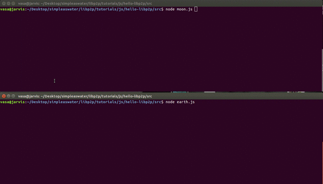

### Getting Started with Libp2p - NodeJS

Here we create a 2 peer Chatting network of Libp2p nodes.

Wanna build it? Check out the tutorial here: [Chat Application using Libp2p](https://simpleaswater.com/libp2p/tutorials/nodejs/getting_started?ref=github_simpleaswater_libp2p)

#### Demo

